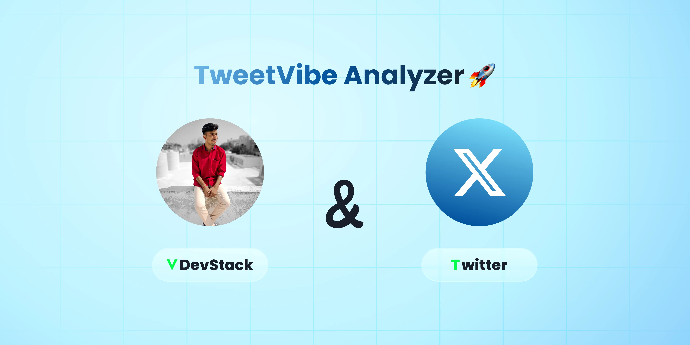

# TweetVibe Analyzer 🚀

## Table of Contents

- [Introduction](#introduction)
- [Objective](#objective)
- [Methodology](#methodology)
- [Key Features](#key-features)
- [Usage](#usage)
- [Findings](#findings)
- [Implications](#implications)
- [Future Work](#future-work)
- [Acknowledgments](#acknowledgments)
- [License](#license)

## Introduction 📢

The **TweetVibe Analyzer** is a sophisticated tool meticulously crafted to decode the intricate emotions concealed within the Twitterverse. Social media platforms, particularly Twitter, serve as reservoirs of user-generated content, making it indispensable to decipher public sentiments, opinions, and trends. This visionary project aspires to illuminate the kaleidoscope of emotions embedded in Twitter content, rendering it an invaluable asset for multifarious applications encompassing brand management, public sentiment analysis, and market research.

## Objective 🎯

The cardinal objective of the TweetVibe Analyzer project is to:

- Forge a robust sentiment analysis pipeline adept at processing the labyrinthine corpus of Twitter data.
- Orchestrate the visual portrayal of sentiment distributions, unfurling profound insights into the ebbs and flows of public emotions.
- Optionally, cultivate and appraise a machine learning model for the prescient prediction of sentiments.
- Apply the acumen of the analyzer to an incisive validation dataset, illuminating the cosmos of Twitter sentiments.
- Chronicle and present the scholarly findings that emerge from this expedition into the social media stratosphere.

## Methodology 📊

The TweetVibe Analyzer project unfurls a meticulous methodology:

1. **Data Collection**: Harnesses training and validation datasets to fuel the analytical engine.
2. **Data Preprocessing**: Adroitly cleanses and preconditions tweet text, priming it for sentiment analysis.
3. **Sentiment Analysis**: Leverages the TextBlob library to classify tweets into "Positive," "Negative," or "Neutral" sentiments.
4. **Visualization**: Depicts the heartbeat of sentiment distributions with the elegance of Plotly, elucidating insights.
5. **Machine Learning (Optional)**: Breeds and scrutinizes machine learning models tailored for sentiment prediction (e.g., the Multinomial Naive Bayes).
6. **Sentiment Prediction**: Navigates the treacherous waters of a validation dataset, etching a narrative of Twitter sentiments.

## Key Features ✨

- **Sentiment Analysis**: Bestows the power to discern the sentiment of Twitter content swiftly and sagaciously.
- **Data Visualization**: Unveils the symphony of sentiments, embracing the medium of visual storytelling with Plotly.
- **Optional Machine Learning**: Bequeaths the ability to nurture and evaluate machine learning models for sentiment prophecy.
- **Versatile Applications**: An indispensable compass for brand caretakers, sentiment archaeologists, and market visionaries.
- **Vista of the Future**: The potential to transcend temporal boundaries, delving into real-time analysis and topic-specific sentiment tracking.

## Usage 🚀

To harness the boundless potential of the TweetVibe Analyzer, embark on this journey:

1. Embark with your Twitter datasets (both training and validation) or embark on a voyage of discovery with our sample datasets.
2. Emboldened by the spirit of analysis, invoke the data preprocessing and sentiment analysis functions.
3. Venture into the realm of visual storytelling with Plotly, casting a spell of enlightenment on sentiment distributions.
4. Optionally, ascend to greater heights with the construction and evaluation of a machine learning model, designed to prophesy sentiments.
5. Finally, embrace the validations, watching as the analyzer breathes life into your dataset, adorning it with the colors of sentiment prediction.

## Findings 📊

### Training Dataset Sentiment Distribution 📈

- The sentiment tapestry of the training dataset weaves a tale where the chorus of "Neutral" sentiments takes center stage, followed by the harmonious notes of "Positive" and "Negative" sentiments.

### Validation Dataset Sentiment Distribution 📉

- The sentiment panorama of the validation dataset mirrors the training dataset, with the "Neutral" sentiments donning the crown of majority.

### Machine Learning Model Performance 🤖

- The machine learning marvel achieved a commendable accuracy of [accuracy_score] when put to the test.
- The pages of the classification report offer a comprehensive evaluation, shining a spotlight on the performance metrics for each sentiment class.

## Implications 🌟

The profound implications of the TweetVibe Analyzer ripple across domains:

1. **Brand Reputation Orchestration**: Be the conductor of brand sentiment, orchestrating harmonious resonances.
2. **Public Sentiment Alchemy**: Transmute the alloys of public sentiment into the gold of insight on social and political currents.
3. **Market Research Odyssey**: Chart a course through the turbulent seas of consumer preferences and trends.
4. **Social Media Engagement Symphony**: Compose the opus of social media campaigns, orchestrated to the cadence of sentiment insights.

## Future Work 🔮

- Elevate the machine learning model to new pinnacles of performance by embarking on explorations of advanced algorithms.
- Unleash the power of real-time Twitter data analysis, as you voyage towards up-to-the-minute enlightenment.
- Embark on topic-specific sentiment escapades, delving into the vibrant cosmos of sentiment analysis on specific hashtags or subjects.
- Craft a user-centric interface, designed to broaden the horizons of accessibility and foster a flourishing community of sentiment analysts.

## Acknowledgments 🙏

The genesis of the TweetVibe Analyzer project bows in gratitude to the luminous constellation of open-source software. Libraries such as TextBlob, Plotly, and scikit-learn have been the guiding stars that have lit our path through the cosmos of sentiment analysis.

## License 📜

This project is licensed under the MIT License - see the [LICENSE](LICENSE) file for details.
